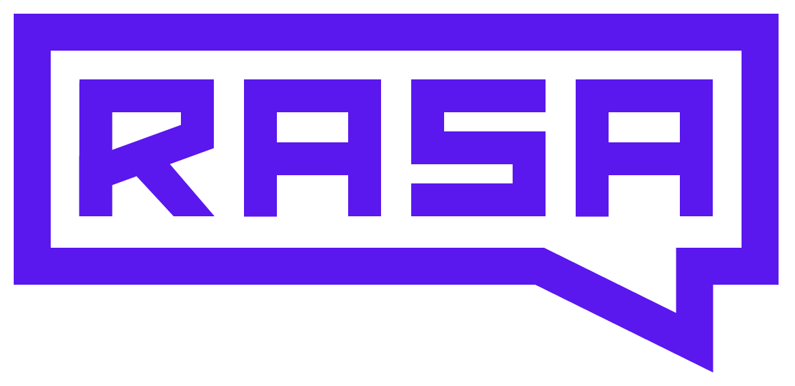

<picture>
  <source media="(prefers-color-scheme: dark)" srcset="./assets/rasa_logo_horizontal_white.png">
  
</picture>

# Customer Starter Packs

### Production-ready AI assistants you can run in minutes.

Open-source starter packs built on Rasa's **[CALM](https://rasa.com/docs/)** framework —
launch one in your browser, fork it, and make it your own.

 

---

## ⚡ Get running in ~60 seconds

1. **Pick a starter pack** from the industry cards below.
2. **Launch it instantly** — click **⚡ Launch on Hello Rasa** to run the assistant right in your browser, no install required. Prefer local? Every pack also runs with Docker (see the pack's README).
3. **Fork & customize** — copy the repo and shape it into your own assistant.

> New to Rasa? The [Rasa Pro Developer Edition](https://rasa.com/docs/rasa-pro/developer-edition/) is **free** and runs CALM assistants locally on your laptop.

---

## 🏭 Pick your industry

<table>
<tr>
<td align="center" valign="top" width="33%">

### 🛡️ Insurance

Guide customers to **file a claim**, **check claim status**, and answer **coverage questions** across home & auto.

</td>
<td align="center" valign="top" width="33%">

### 🏦 Retail Banking

**Transfer money**, **check balances**, **manage payees**, and **block cards** — a full retail-banking assistant.

</td>
<td align="center" valign="top" width="33%">

### 📶 Telecom

**Troubleshoot slow internet** with live diagnostics and **explain & manage bills**, with human-agent handoff.

</td>
</tr>
</table>

---

## 🧰 What you'll need

To run a starter pack locally you'll need:

- 🔑 A **free [Rasa Pro Developer Edition license](https://rasa.com/docs/rasa-pro/developer-edition/)**
- 🤖 An **OpenAI API key** (the default model provider — CALM supports other LLMs too)
- 🐳 **[Docker](https://docs.docker.com/get-started/)** — *or nothing at all if you use [Hello Rasa](https://hello.rasa.com/) in the browser*

Each starter pack's README has step-by-step macOS, Linux, and Windows instructions.

---

## 📚 New to Rasa?

- 🎓 [**Learn CALM**](https://learning.rasa.com/rasa-pro/) — a free introductory course to Rasa's Conversational AI with Language Models framework
- 📖 [**Read the docs**](https://rasa.com/docs/) — guides, references, and tutorials
- 🧩 [**Explore Rasa Studio**](https://rasa.com/product/rasa-studio/) — build and refine assistants visually

---

### Ready to build something real?

&nbsp;&nbsp;

Built with ❤️ by the Rasa team · <a href="https://rasa.com/">rasa.com</a> · <a href="https://forum.rasa.com/">Community forum</a>

